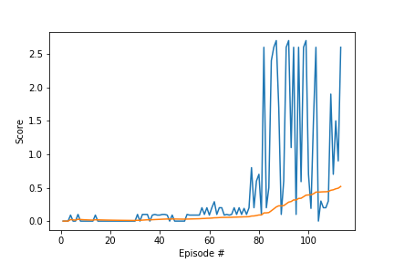

# Project 3: Collaboration and Competition

by Dhruv Baldawa

## Overview

In this environment, two agents control rackets to bounce a ball over a net. If an agent hits the ball over the net, it receives a reward of +0.1.  If an agent lets a ball hit the ground or hits the ball out of bounds, it receives a reward of -0.01.  Thus, the goal of each agent is to keep the ball in play.

The observation space consists of 8 variables corresponding to the position and velocity of the ball and racket. Each agent receives its own, local observation.  Two continuous actions are available, corresponding to movement toward (or away from) the net, and jumping.

The task is episodic, and in order to solve the environment, your agents must get an average score of +0.5 (over 100 consecutive episodes, after taking the maximum over both agents). Specifically,

- After each episode, we add up the rewards that each agent received (without discounting), to get a score for each agent. This yields 2 (potentially different) scores. We then take the maximum of these 2 scores.
- This yields a single **score** for each episode.

The environment is considered solved, when the average (over 100 episodes) of those **scores** is at least +0.5.

## Learning Algorithm

### Methods applied

#### Distributed Deep Deterministic Policy Gradient (D3PG)

We used the D3PG, or Distributed DDPG strategy to solve this environment. We added distributional updates to the DDPG algorithm, combined with the use of multiple distributed workers all writing into the same replay table.

The Deep Deterministic Policy Gradient (DDPG) strategy is used in this solution. It uses 2 deep neural networks - one of the actor and the other one for the critic with the following configuration:

##### Actor network configuration
* Input layer (number of states = 24 nodes) - batch normalized
* ReLU activation Layer
* Fully-connected layer (256 nodes)
* ReLU activation Layer
* Fully-connected layer (256 nodes)
* Output Layer (number of actions = 2 nodes)

##### Critic network configuration
* Input layer (number of states = 24 nodes) - batch normalized
* ReLU activation layer
* Fully-connected layer (258 (256 + number of actions) nodes)
* ReLU activation layer
* Fully-connected layer (256 nodes)
* Output Layer (1 node)

The agent learns every 10 timesteps and then we train the agent with 20 random samples.

#### Prioritized Experience Replay

We’ll be using experience replay memory for training our network. It stores the transitions that the agent observes, allowing us to reuse this data later. By sampling from it randomly, the transitions that build up a batch are decorrelated. It has been shown that this greatly stabilizes and improves the training.

The experiences from all the agents is collected in a single buffer, and samples from this buffer are batched randomly and used to train the networks.

However, I did realize that the scores of the agents were plateauing after a certain number of episodes regularly while training, and learning would slowdown drastically. So, I introduced priority-based sampling instead of randomly choosing samples from the replay buffer. This largely helped with the learning speed and solving the environment.

#### Ornstein-Uhlenbeck Process

We added noise in the network to make it explore more. We are decaying this noise gradually to reduce the effect of noise as the agent is being trained, this also helps the agent to learn faster.

While solving this environment, we tweaked the parameters to add more noise, because I noticed that sometimes the agent would solve the environment but still was not good in certain states. I wanted the agent to explore the environment a little more and hence added some more noise in this environment as compared to P2.

#### Gradient Clipping

Large updates to weights during training can cause a numerical overflow or underflow. To reduce this instability while training, we rescale the gradient function to reduce unwanted effects on the training.

### Hyperparameters

```python
BUFFER_SIZE = int(1e7)            # replay buffer size
BATCH_SIZE = 256                  # minbatch size
GAMMA = 0.99                      # discount factor
TAU = 5e-2                        # for soft update of target parameters
LR_ACTOR = 1e-4                   # learning rate of the actor
LR_CRITIC = 5e-3                  # learning rate of the critic
WEIGHT_DECAY = 0                  # L2 weight decay
UPDATE_EVERY = 10                 # number of timesteps before updating the network
UPDATE_NETWORK = 20               # how many times to update the network
EPSILON = 1                       # epsilon
EPSILON_DECAY = 0.999             # rate at which we should decay epsilon
EPSILON_MIN = 0.1                 # minimum epsilon
MAX_CLIPPING_NORMALIZATION = 1.0  # gradient clipping normalization max value

PRIORITY_A = 0.4                  # alpha for PER
PRIORITY_B = 1 - PRIORITY_A       # beta for PER
PRIORITY_E = 0.01                 # e for PER

CUTOFF_SCORE = 0.5                # average score over the window to consider environment as solved
CUTOFF_WINDOW = 100               # window size

NOISE_MU = 0.
NOISE_THETA = 0.4
NOISE_SIGMA = 0.8
```

## Result

We were able to solve this environment and reach an average of +0.5 over 100 episodes in **113 episodes**




## Future Work

We can apply other algorithms like [Proximal Policy Optimization (PPO)](https://arxiv.org/pdf/1707.06347.pdf) to this environment.

When I was working on the hyperparameters, the noise and prioritized experience replay parameters had a huge effect in the performance and training time for the algorithm. I am sure tweaking the neural network configuration and some hyperparameters can enhance the performance of the network.

It would also be interesting to see how the algorithm will change, if the players were playing against eachother and how would the agent implementation change for that environment.

## References
- [Timothy P. Lillicrap, Jonathan J. Hunt, Alexander Pritzel, Nicolas Heess, Tom Erez, Yuval Tassa, David Silver, Daan Wierstra; Continuous control with deep reinforcement learning, 2015](https://arxiv.org/abs/1509.02971)
- [Gabriel Barth-Maron˚, Matthew W. Hoffman˚, David Budden, Will Dabney, Dan Horgan, Dhruva TB, Alistair Muldal, Nicolas Heess, Timothy Lillicrap; Distributed Distributional Deterministic Policy Gradients, 2018](https://openreview.net/pdf?id=SyZipzbCb)
- [Yan Duan, Xi Chen, Rein Houthooft, John Schulman, Pieter Abbeel; Benchmarking Deep Reinforcement Learning for Continuous Control, 2015](https://arxiv.org/abs/1604.06778)
- [Tom Schaul, John Quan, Ioannis Antonoglou, David Silver; Prioritized Experience Replay, 2015](https://arxiv.org/abs/1511.05952)
